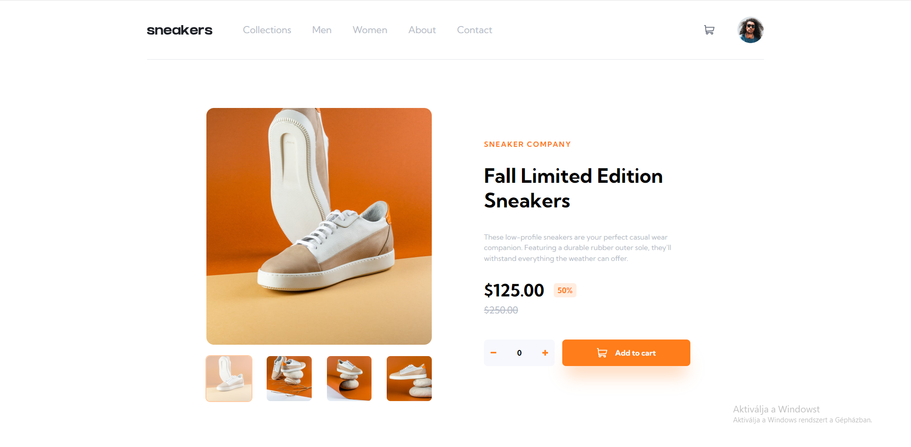

# Frontend Mentor - E-commerce product page solution

This is a solution to the [E-commerce product page challenge on Frontend Mentor](https://www.frontendmentor.io/challenges/ecommerce-product-page-UPsZ9MJp6). Frontend Mentor challenges help you improve your coding skills by building realistic projects.

## Table of contents

- [Overview](#overview)
  - [The challenge](#the-challenge)
  - [Screenshot](#screenshot)
  - [Links](#links)
  - [Built with](#built-with)

## Overview

### The challenge

Users should be able to:

- View the optimal layout for the site depending on their device's screen size
- See hover states for all interactive elements on the page
- Open a lightbox gallery by clicking on the large product image
- Switch the large product image by clicking on the small thumbnail images
- Add items to the cart
- View the cart and remove items from it

### Screenshot

### Links

- Solution URL: (https://www.frontendmentor.io/solutions/ecommerce-website-landing-page-using-reacttailwind-xrwIHOumoO)
- Live Site URL: ([https://your-live-site-url.com](https://e-commerce-landing-page-challenge-bi1kvh7cn-oz-or.vercel.app/))

## My process

### Built with

- Vite
- React
- Tailwind
- Mobile-first workflow
- [React](https://reactjs.org/) - JS library
- [Vite.js](https://vitejs.dev/) - Develpoment Environment
- [Tailwindcss](https://tailwindcss.com/) - For styles
